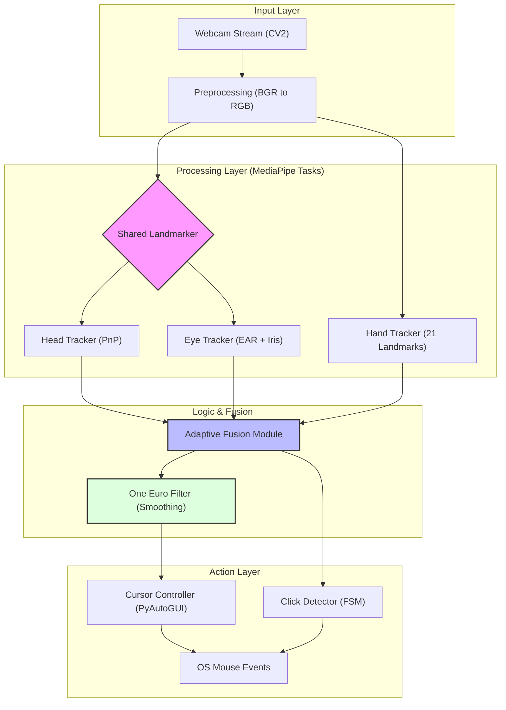

# 🏗️ KURSORIN: System Architecture Guide

> **Version**: 1.2.9  
> **Aesthetic**: Technical Minimalist  
> **Confidence**: HIGH

## Executive Summary
KURSORIN is a high-performance, webcam-based Human-Computer Interaction (HCI) system. It leverages computer vision and machine learning (MediaPipe) to provide hands-free cursor control via multi-modal fusion of head, eye, and hand tracking.

---

## 🧩 Architectural Overview

KURSORIN follows a **Modular Pipeling Architecture**. Each component is isolated, allowing for specialized optimization without side effects on other modalities.

## 🔍 Core Component Deep Dive

### 1. The Engine (`KursorinEngine`)
The central nervous system of the application. It manages the high-frequency threading loop, ensuring that frame acquisition, inference, and cursor movement happen with minimal jitter.

### 2. Shared Face Landmarker
To optimize performance, KURSORIN uses a single MediaPipe Face Mesh instance to drive both Head and Eye tracking. 
- **Head**: 6-DOF Perspective-n-Point (PnP) algorithm.
- **Eye**: EAR (Eye Aspect Ratio) for blinks and Iris-center displacement for gaze.

### 3. Adaptive Fusion Module
Not all trackers are created equal. The Fusion Module applies a **Dynamic Confidence Weighting**:
$$Weight_{final} = Weight_{base} \times Confidence_{detector}$$
If a user looks away or hands leave the frame, the system seamlessly transitions priority to the remaining active modalities.

---

## ⚡ Performance Optimization
- **Multithreading**: GUI and Tracking run on separate threads to prevent UI freezes.
- **NumPy Integration**: All coordinate transformations use vectorized NumPy operations for sub-millisecond overhead.

---

> [!TIP]
> To achieve the best performance, ensure your webcam is centered and your face is well-lit. Minimal background noise significantly improves Hand Tracking stability.
